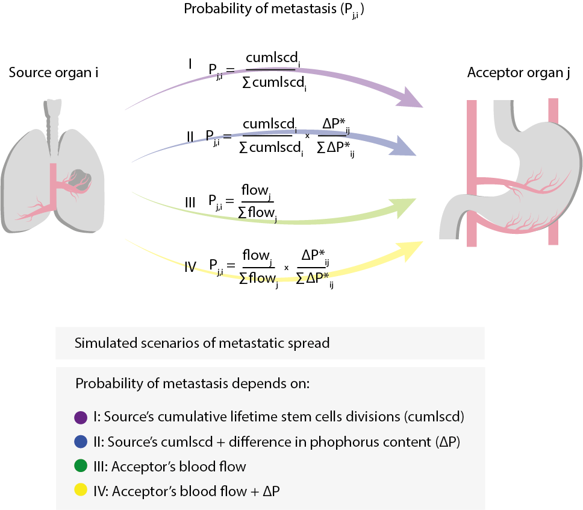

```{r setup, include=FALSE}
knitr::opts_chunk$set(echo = TRUE, warning = FALSE, message = FALSE)

if (!require("pacman")) install.packages("pacman")
pacman::p_load(dplyr, tidyr, survival, knitr, ggplotly, broom)
```

### Preamble

This document is a reproduction of the analysis made in the manuscript 'Metastatic cells exploit their stoichiometric niche in the network of cancer ecosystems' by Castillo SP et al. All the data input and customised functions are available in the repository associated (https://github.com/simonpcastillo/metastaticdiaspora). Further questions, please contact the corresponding authors Simon Castillo (spcastillo@mdanderson.org) or Pablo Marquet (pmarquet@bio.puc.cl).  

### The metastatic network

First, based on records from the literature, we build a bipartite metastatic network. As nodes, this network have organs which can be *source* or *acceptor* organs and as links, we have the number of records of metastases from a source to an acceptor. Hence, we build a weighted bipartite network.

```{r loaddata}
load('data/occurrences.rdata')
paste0('Total number of records: ', sum(df0))
paste0('Total number of source tissues: ', nrow(df0)) # Each row is a Source organ/habitat
paste0('Total number of acceptor tissues: ', ncol(df0)) # Each column is an Acceptor organ/habitat

```

Now, we load the data of occurences to the R environment by using `load('data/occurrences.rdata')`, creating a new object named _df0_. Also, for visualisation, we create the binary matrix ( _df1_ ). For convenience, we sort rows and columns according the degree of each organ in decreasing order. 


```{r matrixmet}
load('data/occurrences.rdata')
df1 <- df0
df1[df1>0]<-1

source <-names(sort(rowSums(df1), decreasing = F))
acceptor <- names(sort(colSums(df1), decreasing = TRUE))
data = expand.grid(Source=source, Acceptor=acceptor)
data$mets <-  as.vector(as.matrix(df0[source, acceptor]))
data$binary <- as.vector(as.matrix(df1[source, acceptor]))
```

With `ggplot` and `plotly` we can visualise both, the weighted metastatic network _df0_ and the binary metatstaic network _df1_.

```{r plotly1, fig.height=5, fig.width=5}
require(plotly)
require(ggplot2)

plot1<- data %>%
  mutate(mets = as.numeric(mets)) %>%
  ggplot(aes(y=Source, x=Acceptor)) + 
  geom_tile(aes(fill= mets)) +
  scale_fill_viridis_c(option = 'B')+
  theme(axis.text.x= element_text(angle = 90, vjust = 0.7,hjust = 1))+
  theme(legend.position='none')

ggplotly(plot1)

plot2<- data %>%
  mutate(binary = as.factor(binary)) %>%
  ggplot(aes(y=Source, x=Acceptor)) + 
  geom_tile(aes(fill=binary)) +
  scale_fill_viridis_d(option = 'D', direction = -1)+
  guides(fill='none')+
  theme(axis.text.x= element_text(angle = 90, vjust = 0.7,hjust = 1))

ggplotly(plot2)
```


#### Topological characterisation

We calculate three topological properties of the network: nestedness, degree distribution, and clustering. 

For nestedness we compute nestedness temperature, NODF2, and wine indices (`bipartite::nested(df0, method = c("binmatnest", 'NODF2', 'wine'))`).

```{r nestedness}
 require(bipartite)
kable(data.frame(value=nested(df0, method = c("binmatnest", 'NODF2', 'wine'))))    
```

For modularity, we calculate the Newman's modularity measure (check `?bipartite::commputeModules()`).

```{r modularity}
set.seed(5)
modul <- metaComputeModules(as.matrix(df0), method = 'Beckett', N = 50)
kable(data.frame(index='modularity', value=modul@likelihood))
```

For the degree distribution, we modified `bipartite::degreedistr()`, adding the second-order Akaike's criterion (AICc) and Bayesian Information Criterion for each fit.

```{r degreedistr}
source('codes/degreedistr3.R')

degreedistr3(df0)
```

#### Null models

For nestedness and clustering, we compared the observed values against null models. With the function `vegan::nullmodel()`, we use two methods to create independent sets of null models: `r0_ind` and `c0_ind`, these methods maintain the total number of cases by Source (row-wise) or Acceptor (column-wise) organ, respectively. We ran 1500 null models for each method. Then, with the null distribution of values, we calcute a z score: 

$$ z = {observed - E{(null)} \over var(null)} $$ 


### Stoichiometric approach

Using estimations from literature, we incorporate the content of phosphorous (P) per organ normalised by organ size (`P.g`). We filter out Bone as an organ/tissue due to that its P availability represent different mechanisms of P-related metabolism. Using a GLM with negative binomial distribution, we tested the relationship between P content and Source and Acceptor degrees, `S_k`, and `A_k`, respectively.

```{r degreeandP}
require(dplyr); require(MASS)
load('data/PandNet_df.rdata')

# Source degree ~ phosphorous content
glm.nb_Sk<- PandNet_df %>% 
  filter(organ != 'Bone', P.g>0) %>% 
  glm.nb(formula=S_k ~ P.g)

  kable(summary(glm.nb_Sk)$coefficients, caption = 'Source degree ~ P')

# Acceptor degree ~ phosphorous content
glm.nb_Ak<- PandNet_df %>% 
  filter(organ != 'Bone', P.g>0) %>% 
  glm.nb(formula=A_k ~ P.g)
  
  kable(summary(glm.nb_Ak)$coefficients, caption = 'Acceptor degree ~ P')


```

In addition to the previous analysis, we then test the relationship between metastatic incidence (number of mets from a Source to an Acceptor over the total) and the difference in P content, Source - Acceptor. We use a zero-inflated regression, as it allows to analyse in a separate fashion the occurrences (`count`, successful colonisations) and the zeros (`zero`, absence of recorded colonisations) in the network. 

```{r }
require(performance); require(pscl); require(plotly)
 load('data/PandBSI_df.rdata')
 
zi_mod<-PandBSI_df %>%
  filter(Source != 'Bone', Acceptor != 'Bone') %>%
  mutate(Source=factor(Source),Incidence = Incidence * overall)%>%
  zeroinfl(formula= Incidence ~ Pdiff)

kable(as.data.frame(summary(zi_mod)$coefficients$zero) %>%
  mutate(`Pr(>|z|)` = format(`Pr(>|z|)`, scientific=TRUE)), 
  caption = 'Effect on metastatic events, count')


kable(as.data.frame(summary(zi_mod)$coefficients$count) %>%
  mutate(`Pr(>|z|)` = format(`Pr(>|z|)`, scientific=TRUE)), 
  caption = 'Effect on failed colonisations, zeros')

# pseudo-R2
r2_zeroinflated(zi_mod, method = c("default"))

ggplotly(PandBSI_df %>%
  filter(Source != 'Bone', Acceptor != 'Bone') %>%
  ggplot(aes(Pdiff, Incidence, colour=Source, size=Incidence, label=Acceptor, 
             text = paste("Source: ",Source,
                          "\n Acceptor: ",Acceptor,
                          "\n Pdiff: ",round(Pdiff,3), 
                          "\n Incidence: ",round(Incidence,4)))) +
  geom_point(alpha=0.7) +
  labs(x='P difference = Source - Acceptor', y= ' Incidence, relative occurrence', colour='')+
  theme_minimal() +
  guides(size='none', label='none')+
  scale_colour_viridis_d(option = 'D'), 
  tooltip = list('text'))

```


### Ecological constraints on mets

Finally, to test the effect of adding the difference in P between Source and Acceptor organs on the likelihood of metastasis, we simulate four metastatic scenarios, using the observed physiological parameters as a constraint on the likelihood of metastatic success.



```{r simmMets, eval=FALSE}
if (!require("pacman")) install.packages("pacman")
pacman::p_load(bipartite,reshape,foreach,doParallel, dplyr, ggplot2, patchwork)


load('data/occurrences.rdata')
load('data/physio_df.rdata')

set.seed(08022023)
set.seed(08132023)
sim<- 1000
mets<-10000

# This pipeline uses parallelisation, the number of cores needs to be defined here:
n.cores=2


#Scenarios I and II: cumscld and dP

fisiosimm<-physio_df %>%
  filter(P.g>0 & cumlscd>0)%>%
  mutate(probPrim=cumlscd/sum(cumlscd))

occ<- df0[rownames(df0) %in% fisiosimm$organ, colnames(df0) %in% fisiosimm$organ]

sMI<- data.frame(Source=rownames(occ), sMI=rowSums(occ)/sum(occ))

overall<-sum(occ)
dataBSI<-occ/overall


Pmatrix<- dataBSI
for (i in 1:nrow(Pmatrix)) {
  for (j in 1:ncol(Pmatrix)) {
    nameSource<-rownames(Pmatrix)[i]
    nameAcceptor<- colnames(Pmatrix)[j] 
    Pdis<- (fisiosimm[fisiosimm$organ== nameSource,]$P.g - fisiosimm[fisiosimm$organ== nameAcceptor,]$P.g)
    
    Pmatrix[i,j]<-Pdis
  }
}

dataBSI<-as.matrix(dataBSI)
Pmatrix<-as.matrix(Pmatrix)

Pmatrixb<- Pmatrix
for(prow in 1:nrow(Pmatrixb)){  
  for(pcol in 1:ncol(Pmatrixb)){
    if(min(Pmatrixb[prow, ])<0){Pmatrixb[prow, pcol]<- 1- (Pmatrix[prow, pcol] + min(Pmatrix[prow, ])*-1)}
  }
}
rowsums<-rowSums(Pmatrixb)
for(prow in 1:nrow(Pmatrixb)){  
  for(pcol in 1:ncol(Pmatrixb)){
    Pmatrixb[prow, pcol]<- Pmatrixb[prow,pcol]/ rowsums[prow] 
  }
}


nulltopo_1<- data.frame()
cl <- makePSOCKcluster(n.cores)
registerDoParallel(cl)  # use multicore, set to the number of our cores

nulltopo_1<-  foreach (nullnets=1:sim, .combine = rbind) %dopar% {
  pacman::p_load(bipartite,reshape,foreach,doParallel, dplyr, ggplot2, patchwork)
  
  print(nullnets/sim*100)
  nullBSI<- matrix(data = 0,ncol=ncol(Pmatrix), nrow=nrow(Pmatrix))
  rownames(nullBSI)<-rownames(dataBSI);colnames(nullBSI)<-colnames(dataBSI)
  
  sc1_probmat = nullBSI
  
  for(sourceid in fisiosimm$organ){
    sc1_probmat[sourceid,] = fisiosimm[fisiosimm$organ==sourceid,'probPrim']
  }
  
  write.csv(sc1_probmat, file='data/sc1_probmatrix.csv')
  
  
  #scenario I
  for(i in 1:mets){
    rrow<-sample(1:nrow(dataBSI),1)
    rcol<-sample(1:ncol(dataBSI),1)
    #pPrim<- fisiosimm[fisiosimm$organ==rownames(dataBSI3)[rrow],]$probPrim
    prob_mets <- sc1_probmat[rrow, rcol]
    if(prob_mets>runif(1)){nullBSI[rrow, rcol]<-nullBSI[rrow, rcol]+1}
  }
  
  nullBSI<- nullBSI/sum(nullBSI)
  gm<- computeModules(nullBSI)
  simnesttemp1<- nestedtemp(nullBSI)$statistic
  simnestnodf1<- nestednodf(nullBSI)$statistic[3]
  simnestwine1<-wine(nullBSI)$wine
  simmod1<-gm@likelihood 
  
  obstemp1<- nestedtemp(dataBSI)$statistic
  obsnodf1<- nestednodf(dataBSI)$statistic[3]
  obswine1<- wine(dataBSI,nreps = 999)$wine
  obsmod1<-computeModules(dataBSI)@likelihood
  
  fit<-lm(c(nullBSI)~c(dataBSI))
  sfit<- summary(fit)
  tstats <- (1-sfit$coefficients[2,1])/sfit$coefficients[2,2]
  # Calculates two tailed probability
  pval<- 2 * pt(abs(tstats), df = df.residual(fit), lower.tail = FALSE)
  
  pcorBSI1<- cor.test(nullBSI, dataBSI,method = 'spearman')$p.value
  corBSI1<-cor.test(nullBSI, dataBSI,method = 'spearman')$estimate
  pval01<-summary(fit)$coefficients[2,4]
  
  write.csv(data.frame(run = nullnets, melt.matrix(nullBSI), melt.matrix(dataBSI)), paste0('data/raw_cor_trueplot/','sc1_run',nullnets,'.csv'))
  
  
  #scenario II
  nullBSI<- matrix(data = 0,ncol=ncol(Pmatrix), nrow=nrow(Pmatrix))
  rownames(nullBSI)<-rownames(dataBSI);colnames(nullBSI)<-colnames(dataBSI)
  
  sc2_probmat = sc1_probmat * Pmatrixb
  write.csv(sc2_probmat, file='data/sc2_probmatrix.csv')
  
  for(i in 1:mets){
    rrow<-sample(1:nrow(dataBSI),1)
    rcol<-sample(1:ncol(dataBSI),1)
    # pPrim<- fisiosimm[fisiosimm$organ==rownames(dataBSI3)[rrow],]$probPrim
    prob_mets = sc2_probmat[rrow, rcol]
    # if(Pmatrixb[rrow, rcol]*pPrim>runif(1)){nullBSI[rrow, rcol]<-nullBSI[rrow, rcol]+1}
    if(prob_mets>runif(1)){nullBSI[rrow, rcol]<-nullBSI[rrow, rcol]+1}
    
  }
  
  nullBSI<- nullBSI/sum(nullBSI)
  gm<- computeModules(nullBSI)
  simnesttemp2<- nestedtemp(nullBSI)$statistic
  simnestnodf2<- nestednodf(nullBSI)$statistic[3]
  simnestwine2<-wine(nullBSI)$wine
  simmod2<-gm@likelihood 
  
  obstemp2<- nestedtemp(dataBSI)$statistic
  obsnodf2<- nestednodf(dataBSI)$statistic[3]
  obswine2<- wine(dataBSI,nreps = 999)$wine
  obsmod2<-computeModules(dataBSI)@likelihood
  
  fit<-lm(c(nullBSI)~c(dataBSI))
  sfit<- summary(fit)
  tstats <- (1-sfit$coefficients[2,1])/sfit$coefficients[2,2]
  # Calculates two tailed probability
  pval<- 2 * pt(abs(tstats), df = df.residual(fit), lower.tail = FALSE)
  
  pcorBSI2<- cor.test(nullBSI, dataBSI,method = 'spearman')$p.value 
  corBSI2<-cor.test(nullBSI, dataBSI, method = 'spearman')$estimate
  pval02<-summary(fit)$coefficients[2,4]
  write.csv(data.frame(run = nullnets, melt.matrix(nullBSI), melt.matrix(dataBSI)), paste0('data/raw_cor_trueplot/','sc2_run',nullnets,'.csv'))
  
  
  df0= data.frame(nullnets,simnesttemp1, simnesttemp2,
                  simnestnodf1, simnestnodf2,
                  simnestwine1, simnestwine2,
                  simmod1,simmod2,
                  corBSI1,corBSI2,
                  pcorBSI1, pcorBSI2,
                  pval01, pval02,
                  obstemp1, obstemp2,
                  obsnodf1, obsnodf2,
                  obswine1, obswine2,
                  obsmod1, obsmod2)
  
  
}

stopCluster(cl)


#Scenarios III and IV: dP and blood flow

fisiosimm<-physio_df %>%
  filter(P.g>0 & flow>0)%>%
  mutate(probFlow=flow/sum(flow))

occ<- df0[rownames(df0) %in% fisiosimm$organ, colnames(df0) %in% fisiosimm$organ]

sMI<- data.frame(Source=rownames(occ), sMI=rowSums(occ)/sum(occ))

overall<-sum(occ)

dataBSI<-occ/overall


Pmatrix<- dataBSI
for (i in 1:nrow(Pmatrix)) {
  for (j in 1:ncol(Pmatrix)) {
    nameSource<-rownames(Pmatrix)[i]
    nameAcceptor<- colnames(Pmatrix)[j] 
    Pdis<- (fisiosimm[fisiosimm$organ== nameSource,]$P.g - fisiosimm[fisiosimm$organ== nameAcceptor,]$P.g)
    Pmatrix[i,j]<-Pdis
  }
}

dataBSI<-as.matrix(dataBSI)
Pmatrix<-as.matrix(Pmatrix)

Pmatrixb<- Pmatrix
for(prow in 1:nrow(Pmatrixb)){  
  for(pcol in 1:ncol(Pmatrixb)){
    if(min(Pmatrixb[prow, ])<0){Pmatrixb[prow, pcol]<- 1- (Pmatrix[prow, pcol] + min(Pmatrix[prow, ])*-1)}
  }
}
rowsums<-rowSums(Pmatrixb)
for(prow in 1:nrow(Pmatrixb)){  
  for(pcol in 1:ncol(Pmatrixb)){
    Pmatrixb[prow, pcol]<- Pmatrixb[prow,pcol]/ rowsums[prow] 
  }
}

nullBSI<- matrix(data = 0,ncol=ncol(Pmatrix), nrow=nrow(Pmatrix))
rownames(nullBSI)<-rownames(dataBSI);colnames(nullBSI)<-colnames(dataBSI)

nulltopo_2<- data.frame()

cl <- makePSOCKcluster(n.cores)
registerDoParallel(cl)  # use multicore, set to the number of our cores

nulltopo_2<-  foreach (nullnets=1:sim, .combine = rbind) %dopar% {
  pacman::p_load(bipartite,reshape,foreach,doParallel, dplyr, ggplot2, patchwork)
  print(nullnets)
  nullBSI<- matrix(data = 0,ncol=ncol(Pmatrix), nrow=nrow(Pmatrix))
  rownames(nullBSI)<-rownames(dataBSI);colnames(nullBSI)<-colnames(dataBSI)
  
  sc3_probmat = nullBSI
  
  for(acceptorid in fisiosimm$organ){
    sc3_probmat[,acceptorid] = fisiosimm[fisiosimm$organ==acceptorid,'probFlow']
  }
  
  write.csv(sc3_probmat, file='data/sc3_probmatrix.csv')
  
  for(i in 1:mets){
    rrow<-sample(1:nrow(dataBSI),1)
    rcol<-sample(1:ncol(dataBSI),1)
    # pFlow<- fisiosimm[fisiosimm$organ==rownames(dataBSI)[rrow],]$probFlow
    prob_mets = sc3_probmat[rrow, rcol]
    
    if(prob_mets>runif(1) ){nullBSI[rrow, rcol]<-nullBSI[rrow, rcol]+1}
    
  }
  nullBSI<- nullBSI/sum(nullBSI)
  
  gm<- computeModules(nullBSI)
  
  
  simnesttemp3<- nestedtemp(nullBSI)$statistic
  simnestnodf3<- nestednodf(nullBSI)$statistic[3]
  simnestwine3<-wine(nullBSI, nreps = 999)$wine
  simmod3<- gm@likelihood
  obstemp3<- nestedtemp(dataBSI)$statistic
  obsnodf3<- nestednodf(dataBSI)$statistic[3]
  obswine3<- wine(dataBSI,nreps = 999)$wine
  obsmod3<-computeModules(dataBSI)@likelihood
  fit<-lm(c(nullBSI)~c(dataBSI))
  sfit<- summary(fit)
  tstats <- (1-sfit$coefficients[2,1])/sfit$coefficients[2,2]
  # Calculates two tailed probability
  pval<- 2 * pt(abs(tstats), df = df.residual(fit), lower.tail = FALSE)
  
  pcorBSI3<- cor.test(nullBSI, dataBSI,method = 'spearman')$p.value
  corBSI3<-cor.test(nullBSI, dataBSI,method = 'spearman')$estimate
  pval03<-sfit$coefficients[2,4]
  write.csv(data.frame(run = nullnets, melt.matrix(nullBSI), melt.matrix(dataBSI)), paste0('data/raw_cor_trueplot/','sc3_run',nullnets,'.csv'))
  
  
  
  #Case B
  nullBSI<- matrix(data = 0,ncol=ncol(Pmatrix), nrow=nrow(Pmatrix))
  rownames(nullBSI)<-rownames(dataBSI);colnames(nullBSI)<-colnames(dataBSI)
  
  sc4_probmat = sc3_probmat * Pmatrixb
  write.csv(sc4_probmat, file='data/sc4_probmatrix.csv')
  
  for(i in 1:mets){
    rrow<-sample(1:nrow(dataBSI),1)
    rcol<-sample(1:ncol(dataBSI),1)
    # pFlow<- fisiosimm[fisiosimm$organ==rownames(dataBSI3)[rrow],]$probFlow
    prob_mets = sc4_probmat[rrow, rcol]
    if(prob_mets>runif(1) ){nullBSI[rrow, rcol]<-nullBSI[rrow, rcol]+1} 
    
  }
  gm<- computeModules(nullBSI)
  
  nullBSI<- nullBSI/sum(nullBSI)
  simnesttemp4<- nestedtemp(nullBSI)$statistic
  simnestnodf4<- nestednodf(nullBSI)$statistic[3]
  simnestwine4<-wine(nullBSI,nreps = 999)$wine
  obstemp4<- nestedtemp(dataBSI)$statistic
  obsnodf4<- nestednodf(dataBSI)$statistic[3]
  obswine4<- wine(dataBSI,nreps = 999)$wine
  obsmod4<-computeModules(dataBSI)@likelihood
  simmod4<-  gm@likelihood
  
  fit<-lm(c(nullBSI)~c(dataBSI))
  sfit<- summary(fit)
  tstats <- (1-sfit$coefficients[2,1])/sfit$coefficients[2,2]
  # Calculates two tailed probability
  pval<- 2 * pt(abs(tstats), df = df.residual(fit), lower.tail = FALSE)
  
  corBSI4<-cor.test(nullBSI, dataBSI,method = 'spearman')$estimate
  pcorBSI4<-cor.test(nullBSI, dataBSI,method = 'spearman')$p.val
  pval04<-sfit$coefficients[2,4]
  write.csv(data.frame(run = nullnets, melt.matrix(nullBSI), melt.matrix(dataBSI)), paste0('data/raw_cor_trueplot/','sc4_run',nullnets,'.csv'))
  
  
  df0= data.frame(nullnets, 
                  simnesttemp3, simnesttemp4,
                  simnestnodf3, simnestnodf4,
                  simnestwine3, simnestwine4,
                  simmod3,simmod4,
                  corBSI3,corBSI4,
                  pcorBSI3, pcorBSI4,
                  pval03, pval04,
                  obstemp3, obstemp4,
                  obsnodf3, obsnodf4,
                  obswine3, obswine4,
                  obsmod3, obsmod4)
  
  
};beepr::beep(sound = 4)

stopCluster(cl)


#Scenarios V and VI: dP and blood flow corrected

fisiosimm<-physio_df %>%
  filter(P.g>0 & flow>0)%>%
  mutate(probFlow=flow/sum(flow))

occ<- df0[rownames(df0) %in% fisiosimm$organ, colnames(df0) %in% fisiosimm$organ]

sMI<- data.frame(Source=rownames(occ), sMI=rowSums(occ)/sum(occ))

overall<-sum(occ)

dataBSI<-occ/overall


Pmatrix<- dataBSI
for (i in 1:nrow(Pmatrix)) {
  for (j in 1:ncol(Pmatrix)) {
    nameSource<-rownames(Pmatrix)[i]
    nameAcceptor<- colnames(Pmatrix)[j] 
    Pdis<- (fisiosimm[fisiosimm$organ== nameSource,]$P.g - fisiosimm[fisiosimm$organ== nameAcceptor,]$P.g)
    Pmatrix[i,j]<-Pdis
  }
}

dataBSI<-as.matrix(dataBSI)
Pmatrix<-as.matrix(Pmatrix)

Pmatrixb<- Pmatrix
for(prow in 1:nrow(Pmatrixb)){  
  for(pcol in 1:ncol(Pmatrixb)){
    if(min(Pmatrixb[prow, ])<0){Pmatrixb[prow, pcol]<- 1- (Pmatrix[prow, pcol] + min(Pmatrix[prow, ])*-1)}
  }
}
rowsums<-rowSums(Pmatrixb)
for(prow in 1:nrow(Pmatrixb)){  
  for(pcol in 1:ncol(Pmatrixb)){
    Pmatrixb[prow, pcol]<- Pmatrixb[prow,pcol]/ rowsums[prow] 
  }
}

nullBSI<- matrix(data = 0,ncol=ncol(Pmatrix), nrow=nrow(Pmatrix))
rownames(nullBSI)<-rownames(dataBSI);colnames(nullBSI)<-colnames(dataBSI)

nulltopo_3<- data.frame()

cl <- makePSOCKcluster(n.cores)
registerDoParallel(cl)  # use multicore, set to the number of our cores

nulltopo_3<-  foreach (nullnets=1:sim, .combine = rbind) %dopar% {
  pacman::p_load(bipartite,reshape,foreach,doParallel, dplyr, ggplot2, patchwork)
  print(nullnets)
  nullBSI<- matrix(data = 0,ncol=ncol(Pmatrix), nrow=nrow(Pmatrix))
  rownames(nullBSI)<-rownames(dataBSI);colnames(nullBSI)<-colnames(dataBSI)
  
  sc5_probmat = nullBSI
  
  for(acceptorid in fisiosimm$organ){
    sc5_probmat[,acceptorid] = fisiosimm[fisiosimm$organ==acceptorid,'probFlow']
  }
  
  sc5_probmat[rownames(sc5_probmat) %in% c('Spleen')] = sc5_probmat[rownames(sc5_probmat) %in% c('Spleen')]/2
  
  
  write.csv(sc5_probmat, file='data/sc5_probmatrix.csv')
  
  for(i in 1:mets){
    rrow<-sample(1:nrow(dataBSI),1)
    rcol<-sample(1:ncol(dataBSI),1)
    # pFlow<- fisiosimm[fisiosimm$organ==rownames(dataBSI)[rrow],]$probFlow
    prob_mets = sc5_probmat[rrow, rcol]
    if(prob_mets>runif(1) ){nullBSI[rrow, rcol]<-nullBSI[rrow, rcol]+1} #& Pmatrix3b[rrow, rcol]>runif(1)
    
  }
  nullBSI<- nullBSI/sum(nullBSI)
  
  gm<- computeModules(nullBSI)
  
  
  simnesttemp5<- nestedtemp(nullBSI)$statistic
  simnestnodf5<- nestednodf(nullBSI)$statistic[3]
  simnestwine5<-wine(nullBSI, nreps = 999)$wine
  simmod5<- gm@likelihood
  obstemp5<- nestedtemp(dataBSI)$statistic
  obsnodf5<- nestednodf(dataBSI)$statistic[3]
  obswine5<- wine(dataBSI,nreps = 999)$wine
  obsmod5<-computeModules(dataBSI)@likelihood
  fit<-lm(c(nullBSI)~c(dataBSI))
  sfit<- summary(fit)
  tstats <- (1-sfit$coefficients[2,1])/sfit$coefficients[2,2]
  # Calculates two tailed probability
  # pval<- 2 * pt(abs(tstats), df = df.residual(fit), lower.tail = FALSE)
  
  pcorBSI5<- cor.test(nullBSI, dataBSI,method = 'spearman')$p.value
  corBSI5<-cor.test(nullBSI, dataBSI,method = 'spearman')$estimate
  pval05<-sfit$coefficients[2,4]
  
  write.csv(data.frame(run = nullnets, melt.matrix(nullBSI), melt.matrix(dataBSI)), paste0('data/raw_cor_trueplot/','sc5_run',nullnets,'.csv'))
  
  
  #Case B
  nullBSI<- matrix(data = 0,ncol=ncol(Pmatrix), nrow=nrow(Pmatrix))
  rownames(nullBSI)<-rownames(dataBSI);colnames(nullBSI)<-colnames(dataBSI)
  
  sc6_probmat = sc5_probmat * Pmatrixb
  write.csv(sc6_probmat, file='data/sc6_probmatrix.csv')
  
  for(i in 1:mets){
    rrow<-sample(1:nrow(dataBSI),1)
    rcol<-sample(1:ncol(dataBSI),1)
    pFlow<- fisiosimm[fisiosimm$organ==rownames(dataBSI)[rrow],]$probFlow
    prob_mets = sc6_probmat[rrow, rcol]
    if(prob_mets>runif(1) ){nullBSI[rrow, rcol]<-nullBSI[rrow, rcol]+1} 
    
  }
  gm<- computeModules(nullBSI)
  
  nullBSI<- nullBSI/sum(nullBSI)
  simnesttemp6<- nestedtemp(nullBSI)$statistic
  simnestnodf6<- nestednodf(nullBSI)$statistic[3]
  simnestwine6<-wine(nullBSI,nreps = 999)$wine
  obstemp6<- nestedtemp(dataBSI)$statistic
  obsnodf6<- nestednodf(dataBSI)$statistic[3]
  obswine6<- wine(dataBSI,nreps = 999)$wine
  obsmod6<-computeModules(dataBSI)@likelihood
  simmod6<-  gm@likelihood
  
  fit<-lm(c(nullBSI)~c(dataBSI))
  sfit<- summary(fit)
  tstats <- (1-sfit$coefficients[2,1])/sfit$coefficients[2,2]
  # Calculates two tailed probability
  # pval<- 2 * pt(abs(tstats), df = df.residual(fit), lower.tail = FALSE)
  
  corBSI6<-cor.test(nullBSI, dataBSI,method = 'spearman')$estimate
  pcorBSI6<-cor.test(nullBSI, dataBSI,method = 'spearman')$p.val
  pval06<-sfit$coefficients[2,4]
  write.csv(data.frame(run = nullnets, melt.matrix(nullBSI), melt.matrix(dataBSI)), paste0('data/raw_cor_trueplot/','sc6_run',nullnets,'.csv'))
  
  
  df0= data.frame(nullnets, 
                  simnesttemp5, simnesttemp6,
                  simnestnodf5, simnestnodf6,
                  simnestwine5, simnestwine6,
                  simmod5,simmod6,
                  corBSI5,corBSI6,
                  pcorBSI5, pcorBSI6,
                  pval05, pval06,
                  obstemp5, obstemp6,
                  obsnodf5, obsnodf6,
                  obswine5, obswine6,
                  obsmod5, obsmod6)
  
  
};beepr::beep(sound = 4)

stopCluster(cl)


```

